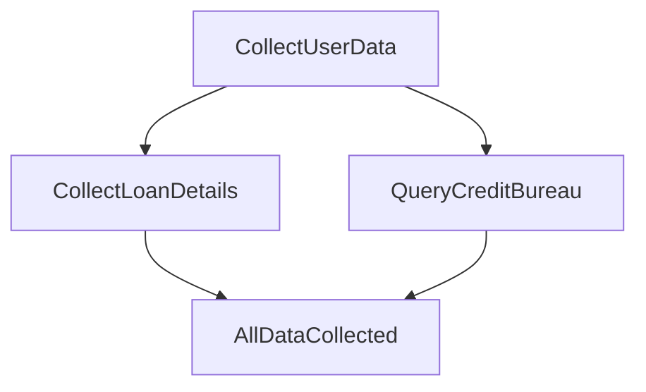

# Domain modelling with state machines

---

## Who am I?

Marco Perone

[@marcoshuttle](https://twitter.com/marcoshuttle)

[marcosh.github.io](http://marcosh.github.io/)

working at [Tweag](https://www.tweag.io/)

---

## Working environment

We will be using [Gitpod](https://gitpod.io/#https://github.com/marcosh/ddd-machines-dddeurope)

https://github.com/marcosh/ddd-machines-dddeurope

---

## Domain modelling


---

### <span style="color: orange">Domain events</span>


Events relevant for domain experts

---

### <span style="color: dodgerblue">Commands</span>


User intentions/actions/decisions

---

### <span style="color: lightgreen">Read models</span>


Data needed in order to make decisions

---

### <span style="color: orchid">Policies</span>


Reactive logic that takes place after an event

---

### <span style="color: yellow">Aggregates</span>


Decide what happens on commands

---

## State machines

```haskell
data Mealy state input output = Mealy
  { initialState :: state
  , action :: state -> input -> (state, output)
  }
```

---

## State machines


---

## Our domain

We are creating a risk management system for a lending application

We collect information about the user and the loan in order to decide wheter to grant the user the requested loan

---

### Workflow



---

### Event storming


---

## Let's cook our ingredients together

---

## <span style="color: yellow">Aggregates</span>, <span style="color: red">projections</span> and <span style="color: orchid">policies</span> could be implemented as state machines

---

### <span style="color: yellow">Aggregates</span>


From <span style="color: dodgerblue">commands</span> to <span style="color: orange">events</span>

---

Let's implement the <span style="color: yellow">aggregate</span> for our domain

---

To compile the code and run the tests

```bash
stack test --file-watch
```

---

### Events

```haskell
data RiskEvent
  = UserDataRegistered UserData
  | LoanDetailsProvided LoanDetails
  | CreditBureauDataReceived CreditBureauData
```

---

### Commands

```haskell
data RiskCommand
  = RegisterUserData UserData
  | ProvideLoanDetails LoanDetails
  | ProvideCreditBureauData CreditBureauData
```

---

What is the state space?

```haskell
data RiskState = _
```

---

Next we need to implement

```haskell
action :: RiskState
       -> RiskCommand
       -> ([RiskEvent], RiskState)
```

and

```haskell
initialState :: RiskState
```

---

### <span style="color: red">Projections</span>


From <span style="color: orange">events</span> to <span style="color: green">read models</span>

---

We want to project the received data, which could or could not be there

```haskell
data ReceivedData = ReceivedData
  { userData         :: Maybe UserData
  , loanDetails      :: Maybe LoanDetails
  , creditBureauData :: Maybe CreditBureauData
  }
```

---

The projection is a state machine with <span style="color: #c7254e">`RiskEvent`</span> as input and <span style="color: #c7254e">`ReceivedData`</span> as output

---

What is the state space?

---

We can define it by implementing

```haskell
action :: ReceivedData -> RiskEvent -> ReceivedData
```

and

```haskell
initialState :: ReceivedData
```

---

### <span style="color: orchid">Policies</span>


From <span style="color: orange">events</span> to <span style="color: dodgerblue">commands</span>

---

<span style="color: orchid">Policies</span> are the only one allowing side effects

---

A policy is a state machine with <span style="color: #c7254e">`RiskEvent`</span> as inputs and <span style="color: #c7254e">`RiskCommand`</span> as outputs.

---

Our policy needs to react to the <span style="color: #c7254e">`UserDataRegistered`</span> event and send the data to the credit bureau, using the <span style="color: #c7254e">`interactWithCreditBureau`</span> function

---

To implement it, we just need to implement

```haskell
action :: RiskEvent -> IO [RiskCommand]
```

---

How do we connect the pieces, now?

---

## Write side

```haskell
feedback
  :: Mealy command [event]
  -> Mealy event   [command]
  -> Mealy command [event]
```

Allows us to combine <span style="color: yellow">Aggregate</span> and <span style="color: orchid">Policy</span>

---

## Whole application

```haskell
instance Category Mealy where
  (.) :: Mealy b c
      -> Mealy a b
      -> Mealy a c
```

Sequential composition

Allows us to compose <span style="color: #c7254e">`Write`</span> and <span style="color: #c7254e">`Read`</span> sides

---

Let's try to run it!

```haskell
-- risk/Main.hs

main :: IO ()
main = print =<< runApplication riskManagerApplication
  [ RegisterUserData myUserData
  , ProvideLoanDetails myLoanDetails
  ]
```

---

To execute it

```bash
stack exec ddd-machines-dddeurope-risk
```

---

## Requirements change

Suppose we want to add another projection

```haskell
userDataUpdatesCounter :: Projection RiskEvent (Sum Int)
```

Let's adapt our application to incorporate it

---

We can use

```haskell
(&&&) :: Projection a b
      -> Projection a c
      -> Projection a (b, c)
```

to run the two projections in parallel

---

Time for question and remarks

---

Thank you all!
