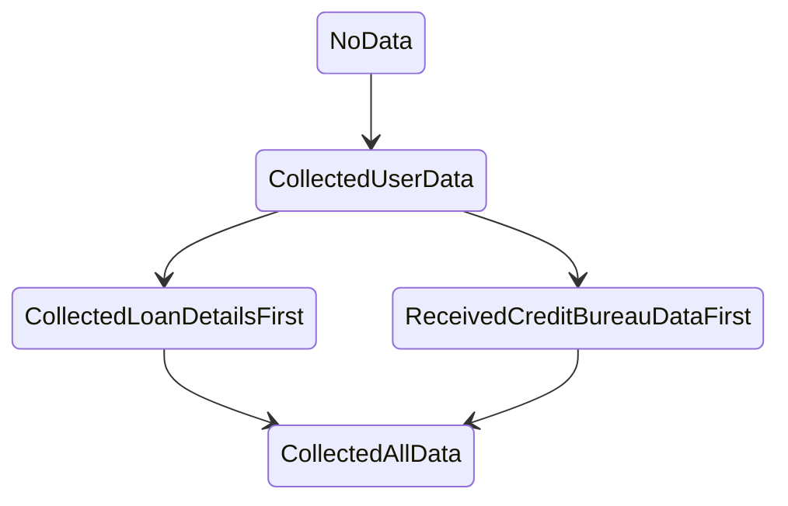

# Domain modelling with state machines

## Who am I

Marco Perone

I work at [Tweag](https://www.tweag.io/)

[http://marcosh.github.io/](http://marcosh.github.io/)

[https://twitter.com/marcoshuttle](https://twitter.com/marcoshuttle)

## Working environment

We will be using [Gitpod](https://gitpod.io/#https://github.com/marcosh/ddd-machines-dddeurope)

## Domain modelling


## State machines

When I say `state machine`, I actually mean a `Mealy machine`

```haskell
data Mealy state input output = Mealy
  { initialState :: state
  , action :: state -> input -> (state, output)
  }
```

## Our domain

Risk manager



### Aggregate

### Policy

### Projection

## Compositionality

## Rendering