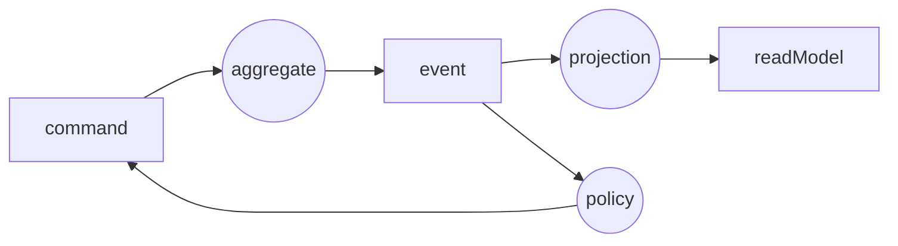
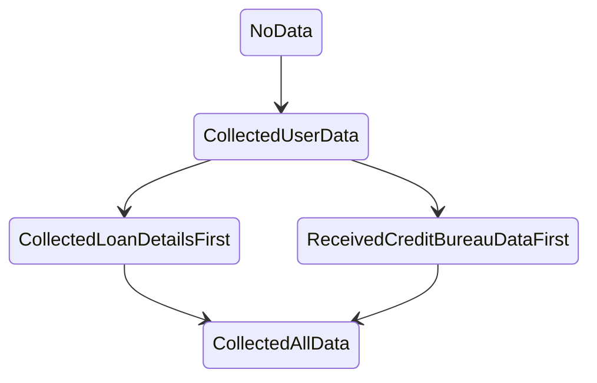

# Domain modelling with state machines

## Who am I

Marco Perone

I work at [Tweag](https://www.tweag.io/)

[http://marcosh.github.io/](http://marcosh.github.io/)

[https://twitter.com/marcoshuttle](https://twitter.com/marcoshuttle)

## Working environment

We will be using [Gitpod](https://gitpod.io/#https://github.com/marcosh/ddd-machines-dddeurope)

## Domain modelling


- <span style="color: orange">Domain events</span>: events relevant for domain experts

- <span style="color: dodgerblue">Commands</span>: user intentions/actions/decisions

- <span style="color: green">Read models</span>: data needed in order to make decisions

- <span style="color: orchid">Policy</span>: reactive logic that takes place after an event

- <span style="color: yellow">Aggregates</span>: responsible to decide what happens on commands

## State machines

When I say `state machine`, I actually mean a `Mealy machine`

```haskell
data Mealy state input output = Mealy
  { initialState :: state
  , action :: state -> input -> (state, output)
  }
```


### Aggregates

Aggregates are state machines with <span style="color: dodgerblue">commands</span> as inputs and <span style="color: orange">events</span> as outputs

### Projections

Projections are state machines with <span style="color: orange">events</span> as inputs and <span style="color: green">read models</span> as outputs

### Policies

Policies are state machines with <span style="color: orange">events</span> as inputs and <span style="color: dodgerblue">commands</span> as outputs.

Policies are the only part of the system where side effects can take place.



## Our domain

**Risk manager**



### Aggregate

To define our `Aggregate` we need to define the initial `State` and, for every `State` and `Command`, which is the next `State` and which `Event`s should be emitted.

### Projection

We want to project the data received until the current state of the process, which could or could not be there.

To define our `Projection` we need to define its initial state and how to update its state for every received `Event`.

### Policy

The policy reacts to `Events` and generates new `Command`s, after possibly interacting with the external world.

Our policy retrieves the credit bureau data after the collection of the user data.

It is actually not stateful, so to define it we just need to specify what to do when we receive an `Event` and return a list of `Command`s

## Compositionality

## Rendering